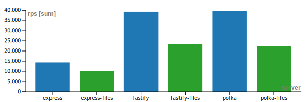
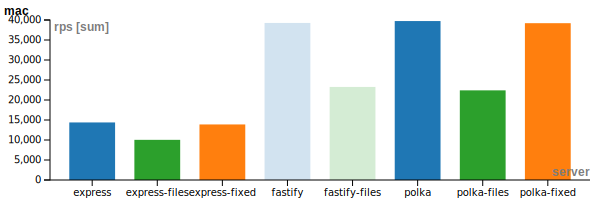
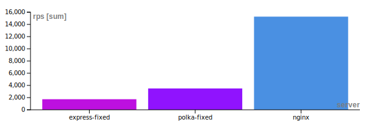

# node-static-server-test

## TL;DR

```
git clone https://github.com/apla/node-static-server-test
sudo apt install wrk
cd node-static-server-test
npm i
npm run --silent bench-all
```


## Serving static files with Node.JS

Node.js have internal `http`/`https` module to create web server.
But almost nobody uses `http.Server` as is, majority of users
are using `Express.js` either directly or indirectly,
as a part of framework like `Next.js`.

[Express.js](https://expressjs.com), with it’s long lived version 4
is famous for it’s somewhat low performance. Other projects
like [fastify](https://www.fastify.io)
or [polka](https://github.com/lukeed/polka) have benchmarks
outperforming `Express.js`. I don’t know why `Express` is slower,
maybe because regex processing of routes?
If you’re using parametric routes like `/users/:userid/entity`
and have no regexp routes, then replacing `Express.js`
with `fastify` or `polka` will add a performance boost to your app.
They are not a direct replacements, but you can convert code
if you really need that boost. In the article below benchmarks
shows huge improvement, but in reality your code will be limiting
factor to yor app performance and you unlikely notice any improvement.

Along with dynamic content, node.js web servers can, obviously,
serve static files. Performance-wise, it is not the best way
to serve static files. Using separate proxy server
like [nginx](https://www.nginx.com) is much better for that purpose.
Linux systems have a few technologies to optimise such tasks.
`sendfile` allows you to stream file contents to socket
using operating system routines and buffers.
`mmap` can be used to map file contents to the memory
and speedup reading purposes. Additionally to system calls above,
nginx can use it’s own caching mechanisms. As your project grows,
you may use AWS/Azure/Google/Cloudflare/whatever CDNs
to distribute static files for users in different regions.
This way you’re trading cost of running your compute nodes
to more cheaper CDN bandwidth.

### Serving static content

Let’s get back to the coding. While you’re writing code for your server,
it’s probably easier to include static file serving into web server code.
And, probably, this should not affect your server performance. Let’s try!

All code snippets and test scripts available on my GitHub repo https://github.com/apla/node-static-server-test.



>Servers with only dynamic routes (higher bars) and with added file serving routine (lower).

Code for static file serving adopted from those pages:

 * https://expressjs.com/en/starter/static-files.html
 * https://expressjs.com/en/resources/middleware/serve-static.html
 * https://github.com/lukeed/polka/blob/master/examples/with-serve-static/index.js
 * https://github.com/fastify/fastify-static

Why web server performance suffers from file serving middleware?
Chaining middlewares is a way to write asynchronous code the same way
as old synchronous code written decades ago. Chained middlewares
dissect request bit by bit and made those bits available
prior to starting main url handler in the app. But everything
comes with a cost. Mapping url to the file system, checking session
from cookie against database, parsing request body and storing uploaded files
in the filesystem consume resources. As an application developer,
you can choose proper way, when you use middleware as a request
processing atoms depending on url. Or Lazy way, where most middlewares
are just generic request parser/validator/something else
and used like `app.use(middleware)`.

Such lazy approach leading to running every application middleware
before processing of every request.

As you can clearly see on the chart, I’ve added file serving middleware
and they run before request. To send file contents to the user,
serve should make sure file exists. So, for every request
web server checks if there is file exists. 

### Filesystem callback

But what I really want, when I adding file serving middleware into my app?
I want my dynamic routes processed as usual, but, _if none matches_,
server should check for path in filesystem. Only as a fallback. 

`Express.js` doesn’t have such handler, but it processes `use` middlewares
as registered by use method. `polka` calls all `use` middlewares at request start,
but have `onNoMatch` handler. `fastify` server page  mentions
[setNotFoundHandler](https://www.fastify.io/docs/latest/Reference/Server/#setnotfoundhandler)
with `preValidation` hook on [lifecycle page](https://www.fastify.io/docs/latest/Reference/Lifecycle/#lifecycle).
But I cannot find a way to use `fastify-static` with `preValidation` hook.

Results:



>File handlers push at the end of middleware list (express)
>or to special _if none matches_ handler (polka). No solution for fastify.

As you can see, proper middleware usage can benefit your app with faster
response times and lower system load. Maybe it’s time to check other
`use`d middlewares and move form validation, body parsing
and other specific middlewares to their own urls?

### Existing static middleware

While I’m browsing source files, I discovered some overengineered static handlers:

 * https://github.com/expressjs/serve-static/blob/master/index.js
 * https://github.com/fastify/fastify-static/blob/master/index.js
 * https://github.com/lukeed/sirv/blob/master/packages/sirv/index.js

At least two of them using send package

https://github.com/expressjs/serve-static/blob/master/index.js

`serve-static` is default for `Express` and `fastify-static` is default for `fastify`;
those packages are much slower than real proxy. They must be used only for testing
and light load scenarios, but with light load, you’re not need
`ETag`, `Cache-Control` and `Max-Age` headers and other engineering efforts
to optimize file serving. `sirv` package does even more. It caches file stat in memory, without revalidating
when file changes. I described why those efforts it is not needed in the beginning
of this article. You can trust me, or you check it out for yourself.



>Express, polka and Nginx comparison on 1K file. RPS values differs
from previous charts because benchmark performed on slower Linux VPS.
I did it on purpose to limit all servers to use only one available cpu core.

Before writing this article I’ve
[seen](https://www.reddit.com/r/node/comments/cu74cz/explain_me_serving_static_files_in_express_in_an/)
[many](https://hashnode.com/post/why-is-it-not-recommended-to-serve-static-files-from-nodejs-ciibz8flv01duj3xt4lxuomp3)
[questions](https://stackoverflow.com/questions/9967887/node-js-itself-or-nginx-frontend-for-serving-static-files)
it is good or not to use Node.JS as http file server. And I have
no definitive answer how much difference I will have. I always used nginx
before node.js to serve static in world-facing services. 

You definitely should not have to use node.js for static files in production. And it is better to use that functionality only in development, because on every unknown dynamic route your web server will check filesystem. But main point of this article is wrongly placed middleware can hurt performance of your app.

### More bad examples

Take a look at Nest.js web server. When file serving option turned on, it is not only slowdown your app because [filesystem checks for every request](https://github.com/nestjs/serve-static/blob/master/lib/loaders/express.loader.ts), but also using [synchronous fs.stat](https://github.com/nestjs/serve-static/commit/532ca9047bc40efeb00f5f0aae3ab7f194097c9b) to check if file really exists.

### Ultimate performance

If you want the best performance at any cost, take a look at uWebSockers.js.
This is very fast web server, developed by Alex Hultman.

On my benchmark uWebSockets.js can handle 74527.95 requests per second while cluster of two polka nodes just 63141.36.

File serving doesn't need any workarounds because routes handling is very thoughtful.

>Pattern matching
>
>Routes are matched in order of specificity, not by the order you register them:
>
>Highest priority - static routes, think "/hello/this/is/static".
>Middle priority - parameter routes, think "/candy/:kind", where >value of :kind is retrieved by req.getParameter(0).
>Lowest priority - wildcard routes, think "/hello/*".
>In other words, the more specific a route is, the earlier it will match. This allows you to define wildcard routes that match a wide >range of URLs and then "carve" out more specific behavior from that.

But performance not so good (10K file):

polka-cluster 17778.46
uwf-fixed 9023.0

I not added this server to compare because author have it's own reasons and way of doing things. For example:

 * npm drama: npm wouldn't allow developer to delete previous versions of his package that had bugs and security issues so he got angry and released an empty package with patch version. npm tagged `latest` latest non-empty package because people complains after suddenly webserver stopper to work. After that, developer deprecated the package ([removed reddit post](https://www.reddit.com/r/node/comments/91kgte/uws_has_been_deprecated/)); https://medium.com/@rockstudillo/beware-of-uwebsockets-js-b51c92cac83f
https://alexhultman.medium.com/beware-of-tin-foil-hattery-f738b620468c
 * [nodejs drama](https://github.com/uNetworking/uWebSockets.js/discussions/171): developer doesn't want to comply with existing nodejs interfaces with it's own nodejs package. «What Node.js does with their streams has no significance to this project. If you see similarities - good - but that doesn't mean anything more than that there are similarities. The entire premise, the hypothesis of this project since day 1 has always been and will continue to be: "Node.js is doing things unreasonably inefficient." In other words - the differences between this project and Node.js is no act of random.»
 * another npm drama: https://github.com/uNetworking/uWebSockets.js/discussions/413
 * Freedom truckers convoy icon on Github profile. Does he supports only AntiCovid hysteria or horn punishment for Ottawa citizens too?

To me, this developer is in the good company of authors of leftpad, event-stream, node-ipc. I don't trust uWebSockets.js author an I will never use it in my own projects.


npm i uWebSockets.js@uNetworking/uWebSockets.js#v20.6.0

https://github.com/uNetworking/uWebSockets/blob/master/misc/READMORE.md


After adding 

### Data used in the article

```
server,var,os,rps
express,,mac,14388.95
express-files,static,mac,10039.27
polka,,mac,39736.39
polka-files,static,mac,22411.12
fastify,,mac,39266.82
fastify-files,static,mac,23271.10
```

```
server,var,os,rps
express,,linux,4804.01
express-files,static,linux,3512.84
express-fixed,fixed,linux,4902.01
polka,,linux,13964.56
polka-files,static,linux,7816.86
polka-fixed,fixed,linux,14142.73
fastify,,linux,13731.78
fastify-files,static,linux,8786.26
```

1K file

```
server,os,rps
nginx,linux,15273.08
express-fixed,linux,1733.78
polka-fixed,linux,3496.40
uws-fixed,linux,2625.79
```

#### Chart software

https://rawgraphs.io


### uWebSockets

https://medium.com/@rockstudillo/beware-of-uwebsockets-js-b51c92cac83f
https://alexhultman.medium.com/beware-of-tin-foil-hattery-f738b620468c

also alexhultman have github icon with free truckers

npm i uWebSockets.js@uNetworking/uWebSockets.js#v20.6.0

https://github.com/uNetworking/uWebSockets/blob/master/misc/READMORE.md

Pattern matching

Routes are matched in order of specificity, not by the order you register them:

Highest priority - static routes, think "/hello/this/is/static".
Middle priority - parameter routes, think "/candy/:kind", where value of :kind is retrieved by req.getParameter(0).
Lowest priority - wildcard routes, think "/hello/*".
In other words, the more specific a route is, the earlier it will match. This allows you to define wildcard routes that match a wide range of URLs and then "carve" out more specific behavior from that.
